# reddit-engagement-classifier

Distributed PySpark ML pipeline that classifies Reddit post engagement archetypes (viral, crowd-pleaser, debate-starter, low-engagement) using NLP feature engineering on 89GB of Pushshift Reddit data.

## Dataset

**Source:** [Pushshift Reddit Submissions Dataset](https://huggingface.co/datasets/fddemarco/pushshift-reddit)  
**Host:** HuggingFace (`fddemarco/pushshift-reddit`)  
**Format:** Parquet  
**Size:** ~89 GB, 549+ million rows  

| Column | Type | Description |
|---|---|---|
| `id` | string | Unique post identifier |
| `author` | string | Reddit username of poster |
| `subreddit` | string | Community the post was submitted to |
| `subreddit_id` | string | Unique subreddit identifier |
| `title` | string | Post title text |
| `selftext` | string | Post body text (empty for link posts) |
| `score` | long | Net upvotes at time of archival |
| `num_comments` | long | Comment count at time of archival |
| `created_utc` | long | Unix timestamp of post creation |

## Environment Setup

### Cluster and Repository Access
All work for this repo was performed on the SDSC Expanse HPC cluster. Configuration settings must be set based on environment. 

1. Log into the Expanse. 
2. Clone the repository:
```bash
git clone https://github.com/eugenefkim/reddit-engagement-classifier.git
cd reddit-engagement-classifier
```

### Data Access

> **Note:** The module versions configured in the data load instructions below (`cpu/0.15.4`, `gcc/10.2.0`) are specific to the SDSC Expanse cluster Python 3.6 settings. Data loading instructions must be tailored based on working environment.

The dataset is hosted on HuggingFace and will be downloaded directly to the cluster for this repository structure. Raw data files are gitignored.

To download the data, open and run the [`notebooks/data_download.ipynb`](notebooks/data_download.ipynb) notebook sequentally from your JupyterLab session on Expanse, following the notebook instructions. This must be run on a compute node (not the login node) to avoid memory limitations, and should be run using Jupyter Notebook settings. 

The dataset is downloaded into `data/raw/`, approximately 89GB of 218 Parquet files. The notebook loads data directly from `data/raw/` using a relative path.


## Milestone 4 — Dimensionality Reduction (SVD/LSA) and Logistic Regression

### Overview

Milestone 3 established that test performance is structurally bounded: roughly 48.6% of the 2018 test set consists of authors with no training-period history, so the author/subreddit aggregate features that dominate the baseline carry no signal for nearly half of test. Content-derived features are then our focus for Milestone 4. We decided to go with a TF-IDF under the impression that certain rare words could help us with our hard classes debate-starter and crowd-pleaser. The Word2Vec title embeddings were explored and did not provide viable lift. 

This milestone reduces that sparse data created by TF-IDF with **Truncated SVD**, the standard form of **Latent Semantic Analysis (LSA)** for TF-IDF, then trains logistic regression models on the resulting combined feature vector. We deviated from our previous LightBGM exploration because we did not know a linear model would be allowed for Milestone 4. A linear model provides a solid comparison model to our XGBoost tree-based model. The XGBoost model (Config B) from M3 will also be trained on the finalized SVD feature set (with some dropped features). 

### SparkSession Configuration (Milestone 4)

```python
spark = SparkSession.builder \
    .appName("PushshiftRedditSVD") \
    .config("spark.driver.memory", "120g") \
    .config("spark.driver.maxResultSize", "8g") \
    .config("spark.sql.shuffle.partitions", "200") \
    .config("spark.sql.parquet.enableVectorizedReader", "true") \
    .config("spark.local.dir", "/expanse/lustre/projects/uci157/ekim18/spark-tmp") \
    .getOrCreate()
```

### TF-IDF Feature Engineering

A 10,000-dimensional TF-IDF representation of post titles was constructed using `pyspark.ml.feature.HashingTF` + `IDF`, fit on a ~2M subsample of the training split only and applied to all three splits due to computational limitations.

### Truncated SVD (Latent Semantic Analysis)

`pyspark.mllib.linalg.distributed.RowMatrix.computeSVD` was used rather than `pyspark.ml.feature.PCA` deliberately: PCA mean-centers the matrix, which turns every structural zero into a nonzero entry and is much tougher on memory. LSA preserves sparsity.

```python
from pyspark.mllib.linalg import Vectors as MLLibVectors
from pyspark.mllib.linalg.distributed import RowMatrix

K = 100
N_HASH_FEATURES = 10000

# Convert ml.linalg.SparseVector -> mllib.linalg.Vector (sparsity-preserving bridge)
train_rows = (
    train_sample
    .select("title_tfidf")
    .rdd
    .map(lambda r: MLLibVectors.fromML(r.title_tfidf))
).persist(StorageLevel.MEMORY_AND_DISK)

mat = RowMatrix(train_rows, numRows=n_train, numCols=N_HASH_FEATURES)

# computeU=False: only V (10000 x k, local) and s needed for projection
svd = mat.computeSVD(K, computeU=False)
```

The SVD was fit on a ~2M-row subsample of the training split. The full 83M-row fit was extrapolated at ~33 hours, not viable before submission. So the subsample fit serves as the production SVD: the leading singular directions of a 10k TF-IDF space stabilize well below the full row count. `V` (10,000 × 100) and `s` (100 singular values) were persisted to `../models/svd_title_k100_v2/` (gitignored).

**Explained energy results:** The singular values are nearly flat after the first component (σ₁ = 1,244; components 2–100 ≈ 550–880). Cumulative explained energy reaches 7.9% at k=100, rising almost linearly across the retained range with no elbow.

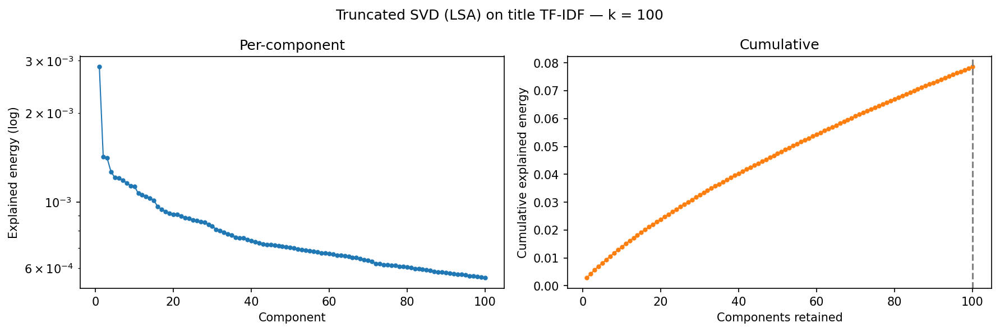

### SVD Transform

Each split's `title_tfidf` vector was projected into the 100-dimensional SVD subspace via a broadcast UDF operating only over nonzero indices:

```python
V_bc = spark.sparkContext.broadcast(svd.V.toArray().astype(np.float32))  # 10000 x 100

@F.udf(VectorUDT())
def project(v):
    out = np.zeros(100, dtype=np.float32)
    Vmat = V_bc.value
    for idx, val in zip(v.indices, v.values):
        out += val * Vmat[idx]
    return Vectors.dense(out)

for name, df in {"train": train_tfidf, "val": val_tfidf, "test": test_tfidf}.items():
    df.withColumn("svd_features", project("title_tfidf")) \
      .drop("title_tfidf") \
      .write.mode("overwrite").parquet(OUT[name])
```

### Feature Assembly (117-dim vector)

Logistic regression cannot handle the NaN cold-start aggregates that XGBoost managed natively. The five nullable aggregate features were median-imputed (Imputer fit on train only); `is_new_author` / `is_new_subreddit` flags mark imputed rows. Four zero-importance structural features (`has_title`, `has_question`, `has_exclamation`, `title_is_allcaps`) identified in M3 were dropped.

Final vector: **12 row-local structured + 5 imputed aggregates + 100 SVD components = 117 dimensions**

```python
from pyspark.ml.feature import Imputer, VectorAssembler

AGG    = ["author_post_count","author_mean_score","subreddit_post_count",
          "subreddit_median_score","subreddit_median_comments"]
NONAGG = ["title_len","title_has_number","is_text_post","selftext_len",
          "hour_of_day","day_of_week","is_known_bot","is_anonymous_author",
          "is_new_author","is_new_subreddit","title_sentiment","selftext_sentiment"]

imputer = Imputer(strategy="median", inputCols=AGG,
                  outputCols=[c+"_imp" for c in AGG]).fit(train_s)

assembler = VectorAssembler(
    inputCols=NONAGG + [c+"_imp" for c in AGG] + ["svd_features"],
    outputCol="features", handleInvalid="error")
```

### Logistic Regression Training

Four logistic regression models were trained: multinomial (4-class) and binomial (binary), each in a conservative (A, regParam=0.1) and lighter (B, regParam=0.01) L2 regularization configuration, mirroring M3's Config A/B structure.

```python
from pyspark.ml.classification import LogisticRegression

specs = [
    ("lr_4class_A", "label_4class_idx", "weight_4class", "multinomial", 0.1),
    ("lr_4class_B", "label_4class_idx", "weight_4class", "multinomial", 0.01),
    ("lr_binary_A", "label_binary_idx", "weight_binary", "binomial",    0.1),
    ("lr_binary_B", "label_binary_idx", "weight_binary", "binomial",    0.01),
]
for key, lab, wt, fam, rp in specs:
    lr = LogisticRegression(featuresCol="features", labelCol=lab, weightCol=wt,
                            family=fam, maxIter=100, regParam=rp, elasticNetParam=0.0)
    m = lr.fit(train_a)
    m.write().overwrite().save(f"../models/{key}_v2/")
```

### Model Evaluation Results (Milestone 4)

**4-Class and Binary Weighted F1:**

| Model | regParam | Train WF1 | Val WF1 | Test WF1 |
|---|---|---|---|---|
| lr_4class_A | 0.10 | 0.4324 | 0.4783 | 0.4707 |
| lr_4class_B | 0.01 | 0.4424 | 0.4913 | 0.4793 |
| lr_binary_A | 0.10 | 0.6370 | 0.6744 | 0.6683 |
| lr_binary_B | 0.01 | 0.6464 | 0.6815 | 0.6723 |

*M3 XGBoost baselines for reference: 4-class test WF1 = 0.4514 (Config A); binary test WF1 = 0.6260 (Config A).*

The lighter-regularization Config B models edge out Config A on every split. Both 4-class (0.4793) and binary (0.6723) test WF1 exceed the structured-only M3 XGBoost baselines, confirming that SVD content features add predictive signal beyond the structured feature set alone.

**WF1 by Split:**

The grouped weighted-F1-by-split figure for all four logistic configurations is shown below, compared to the XGBoost baseline:

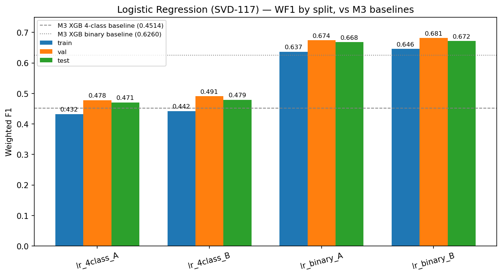

**Confusion matrices (Config B, test split) — granular counts:**

The diagonal entries are correct classifications; off-diagonal entries are the per-class false positives and false negatives.

**4-class test confusion (rows = actual, columns = predicted):**

| Actual \ Predicted | low-engagement | viral | crowd-pleaser | debate-starter |
|---|---|---|---|---|
| low-engagement | 28,374,720 | 14,021,389 | 4,087,807 | 13,420,759 |
| viral | 6,749,440 | 32,166,292 | 3,222,153 | 7,990,304 |
| crowd-pleaser | 5,484,035 | 6,021,172 | 2,807,006 | 3,845,222 |
| debate-starter | 4,162,791 | 6,183,453 | 1,037,239 | 5,375,237 |

Per-class one-vs-rest counts:

| Class | TP | FP | FN | TN |
|---|---|---|---|---|
| low-engagement | 28,374,720 | 16,396,266 | 31,529,955 | 68,648,078 |
| viral | 32,166,292 | 26,226,014 | 17,961,897 | 68,594,816 |
| crowd-pleaser | 2,807,006 | 8,347,199 | 15,350,429 | 118,444,385 |
| debate-starter | 5,375,237 | 25,256,285 | 11,383,483 | 102,934,014 |

**Binary test confusion (rows = actual, columns = predicted):**

| Actual \ Predicted | high-engagement | low-engagement |
|---|---|---|
| high-engagement | 60,219,254 | 24,825,090 |
| low-engagement | 22,788,302 | 37,116,373 |

Per-class one-vs-rest counts:

| Class | TP | FP | FN | TN |
|---|---|---|---|---|
| high-engagement | 60,219,254 | 22,788,302 | 24,825,090 | 37,116,373 |
| low-engagement | 37,116,373 | 24,825,090 | 22,788,302 | 60,219,254 |

> [!NOTE]
> Row-normalized versions of these confusion matrices, which make the per-class recall structure easier to read at a glance, are shown in the written report Figures section.

Test WF1 exceeds train WF1 across all four models. This is consistent with the evaluation design rather than anomalous generalization: training predictions come from class-weighted fits over the balanced 30% stratified sample, while val/test carry the natural class distribution. The near-zero train/test gap combined with low minority-class F1 (crowd-pleaser ~0.19, debate-starter ~0.23) indicates high bias in the linear model, it lacks the capacity to separate the middle engagement tiers, not the variance that would indicate overfitting.


---

# Written Report

## Introduction

Reddit is one of the largest social platforms in the world, organized into thousands of distinct communities (subreddits) each with their own norms, audiences, and engagement patterns. Understanding what drives post engagement has practical implications for content moderation, platform health, and proactive resource allocation, particularly for identifying posts likely to generate contentious or high-volume discussion before comments arrive.

Existing work on social media engagement prediction typically frames the problem as binary (popular vs. not) or as a regression over raw vote counts. This conflates qualitatively different engagement outcomes: a post can accumulate high scores with minimal discussion, or generate extensive debate while remaining score-neutral or negative. We argue that a further segmented engagement archetype derived from the joint distribution of score and comment volume relative to community norms is a more meaningful and actionable prediction target than a simple high vs. low engagement model. Our project seeks to gain further classification insight from the juxtaposition of our proposed four-tier class model to a standard two-tier class model.

This project uses the Pushshift Reddit Submissions Dataset, a public archive of Reddit posts hosted on HuggingFace, totaling approximately 89 GB and containing over 549 million submissions. We propose a multiclass classification pipeline in PySpark that predicts a post's engagement archetype (viral, crowd-pleaser, debate-starter, or low-engagement) using pre-publication features derived from title linguistics, author posting history, subreddit context, and temporal patterns.

We define four engagement archetypes:
- **Viral**: high score, high comments — broadly appealing and discussion-generating
- **Crowd-pleaser**: high score, low comments — well-received but not discussion-driving
- **Debate-starter**: low score, high comments — controversial or polarizing content
- **Low-engagement**: low score, low comments — did not resonate with the community

Class boundaries are assigned using per-subreddit quantile thresholds rather than global thresholds, accounting for the fact that 100 comments is unremarkable in r/AskReddit but exceptional in a small niche subreddit. This analysis requires distributed processing because constructing per-author behavioral features across hundreds of millions of posts, computing per-subreddit engagement baselines, and performing temporal aggregations exceed the memory and compute capacity of a single machine.


## Figures

This section collects the key visualizations that narrate the project, spanning data exploration, the SVD dimensionality reduction, model performance, and prediction behavior. Please note, some Milestone 4 figures are re-used below and component plots do not apply with HashingTF. 

### Data Exploration

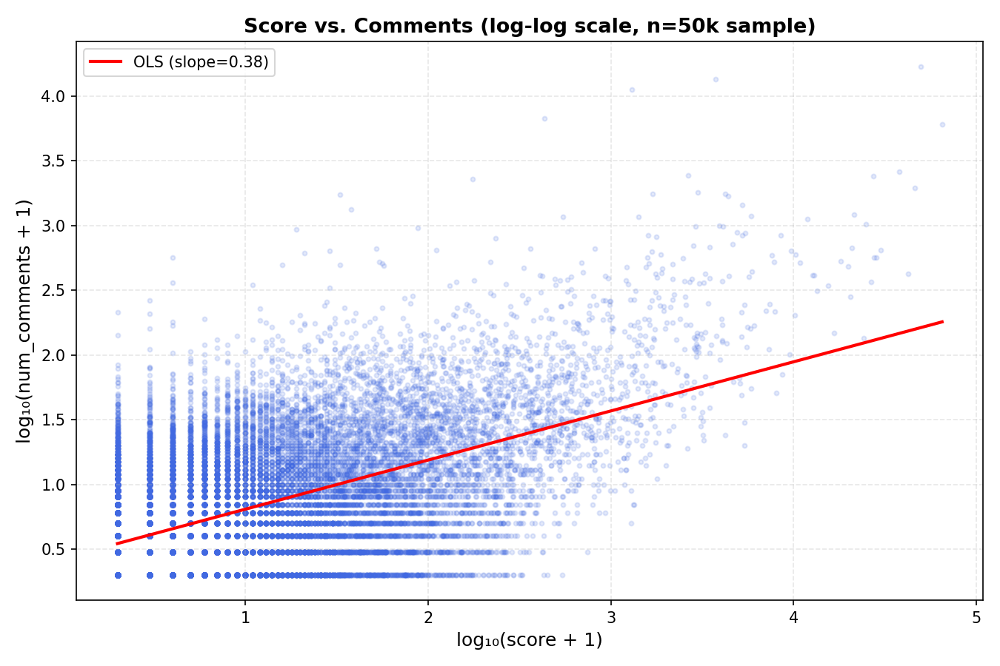

**Figure 1. Score versus comment count (log-log, 50k-post sample).** A weak positive correlation with substantial scatter shows that score and comment count capture different engagement phenomena rather than redundant signal. Posts in the high-comment, low-score region correspond to debate-starters and posts in the high-score, low-comment region to crowd-pleasers. This dispersion is the empirical justification for a four-archetype label built on the joint distribution of both axes rather than a single popularity metric.

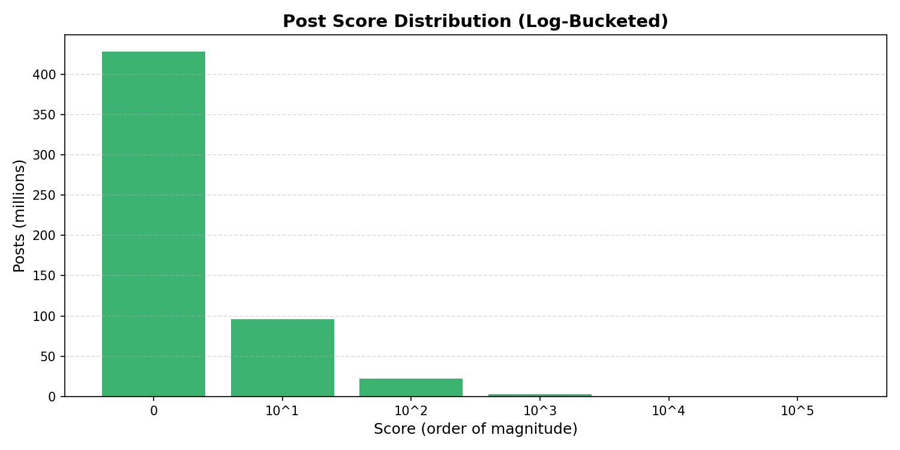

**Figure 2. Post score distribution across the full corpus.** Score is heavily right-skewed, with the vast majority of posts in the single-digit range and each higher order of magnitude containing far fewer posts. A global engagement threshold would therefore classify nearly everything as low-engagement, motivating the per-subreddit quantile thresholds used to define the labels.

### Dimensionality Reduction (SVD / LSA)


**Figure 3. Explained Frobenius energy of the truncated SVD.** The singular spectrum is steep only at the first component and nearly flat thereafter, and cumulative explained energy reaches just 7.9 percent at k=100 while rising almost linearly with no elbow. The title TF-IDF matrix has high effective rank, so no dimensionality reaches a conventional variance threshold and k=100 is selected as a compute and performance tradeoff rather than an energy target.

### Model Performance


**Figure 4. Final model weighted F1 by split (Model 2, SVD + logistic regression).** All four logistic configurations are shown across train, validation, and test. The lighter-regularization Config B edges Config A on every split, and both the 4-class (0.479) and binary (0.672) test results exceed the structured-only Model 1 baselines, indicating that the SVD title features contribute predictive signal.

### Predictions

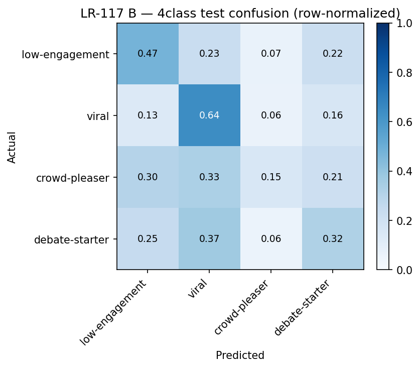

**Figure 5. Row-normalized 4-class confusion matrix on test (final model).** The diagonal shows correct classifications and the off-diagonal entries show false positives and false negatives per class. Low-engagement and viral are recovered well, while the middle archetypes crowd-pleaser and debate-starter are frequently absorbed into the two majority classes, the central limitation of a linear decision boundary on classes that are not linearly separable.

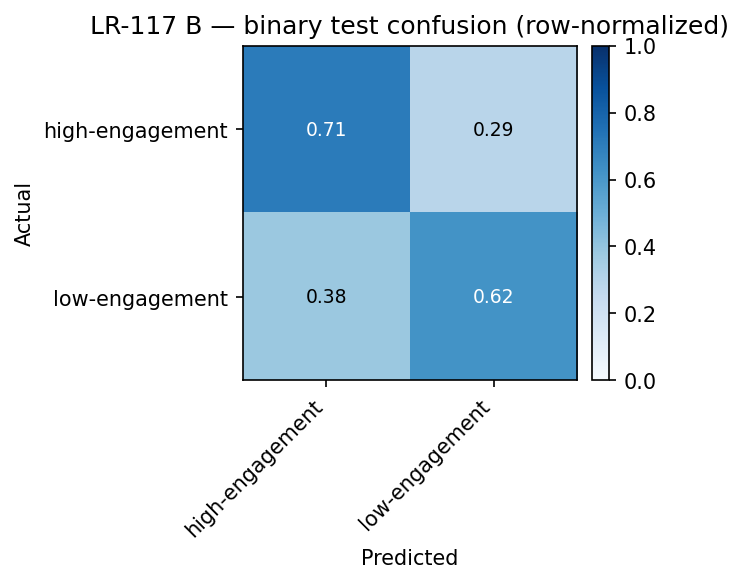

**Figure 6. Row-normalized binary confusion matrix on test (final model).** The high versus low engagement distinction is recovered far more cleanly than the four-tier task, with both classes correctly classified at well above chance and a modest lean toward predicting high-engagement.


## Methods

### Data Exploration

The full 549,662,955-post dataset was profiled in Milestone 2 using PySpark DataFrame operations on SDSC Expanse. Key findings: both `score` (mean 44.84, std 707.38) and `num_comments` (mean 8.36, std 93.11) are extremely right-skewed, confirming that global engagement thresholds would label nearly everything as low-engagement. This led us to believe that looking locally at subreddits and evaluating engagement on quantiles for each subreddit would be more effective.

Additionally, a critical data quality issue was discovered: Pushshift stores missing `selftext` as empty strings rather than SQL NULLs, and deleted authors as the literal string `[deleted]`. Naive null-checks miss both entirely.

### Preprocessing

All preprocessing ran on the full 535,480,818-row filtered dataset in PySpark on SDSC Expanse.

**Filtering:** 
Rows with null `subreddit`/`subreddit_id` (~306K), null `score` (21), and negative `num_comments` (1,090) were removed. The single duplicate post ID was retained as the removal was not worth the compute cost. 

**Label generation:** 
Per-subreddit 75th percentile thresholds for `score` and `num_comments` were computed via `Window.partitionBy("subreddit")` + `percentile_approx()`, then a four-way conditional assigned each post its engagement archetype. A binary high/low label was generated in parallel. As a result, subreddits that did not meet a minimum threshold of 100 posts (rows) were filtered out as they produced degenerate thresholds and arguably did not mimic the behavior of the overall dataset. 

**Feature engineering:** 
Two feature sets were constructed, both from pre-publication information only. The Milestone 3 structured set comprised of 21 features: title structural features (length, number presence, sentiment via a VADER UDF), post-type flags (`is_text_post`, `selftext_len`), author flags (`is_known_bot`, `is_anonymous_author`), temporal features (`hour_of_day`, `day_of_week`), author-history aggregations (`author_post_count`, `author_mean_score`), and subreddit-context aggregations (`subreddit_post_count`, `subreddit_median_score`, `subreddit_median_comments`).

All per-author and per-subreddit aggregations are computed over the **training period only** (2012–2016) and then joined onto the validation and test rows as fixed, training-derived statistics, so that no held-out row is described by features computed from its own or a future period. Authors and subreddits first appearing in the validation or test periods (2017–2018) therefore have no training-period aggregate values; these are left null and either handled natively by XGBoost or median-imputed for the logistic model. Two binary indicator features, `is_new_author` and `is_new_subreddit`, flag exactly these rows.

For Milestone 4, the structured set was extended with a content representation of post titles: a 10,000-dimensional TF-IDF vector (`HashingTF` + `IDF`, fit on the training split only), reduced to 100 dimensions via truncated SVD. Four structural features with zero importance in Milestone 3 (`has_title`, `has_question`, `has_exclamation`, `title_is_allcaps`) were dropped, and the 100 SVD components were concatenated with the 17 retained structured features to form the 117-dimensional Milestone 4 feature vector. Both M3 and M4 models are trained on the final feature set in the M4 notebook so that a proper comparison framework can be executed. 

**Train/val/test split:** 
A temporal split by post year: train (2012–2016, 276,442,594 rows), validation (2017, 114,089,205 rows), and test (2018, 144,949,019 rows). The temporal ordering ensures the model is always evaluated on posts from a period strictly later than its training data.


### Model 1: Distributed XGBoost on Structure Features — 4-Class and Binary Label

> [!IMPORTANT]
> A target leak was detected during Milestone 4. The model configurations and results below are the **final, leakage-corrected** numbers. Four features found statistically insignificant in Milestone 3 (`has_title`, `has_question`, `has_exclamation`, `title_is_allcaps`) were removed in Milestone 4 and are not reflected in the Model 2 numbers.  

`SparkXGBClassifier` (XGBoost 2.0.3) was trained on a 30% stratified sample of the full 276M-row training split (~83M rows). Two configurations were trained on both the 4-class and binary tasks (four models total):

**Config A (conservative):** `max_depth=4`, `n_estimators=200`, `learning_rate=0.05`, `subsample=0.8`, `colsample_bytree=0.8`, `reg_lambda=5.0`, `reg_alpha=1.0`, `min_child_weight=50`

**Config B (aggressive):** `max_depth=8`, `n_estimators=300`, `learning_rate=0.1`, `subsample=0.7`, `colsample_bytree=0.7`, `reg_lambda=1.0`, `reg_alpha=0.0`, `min_child_weight=10`

Inverse-frequency class weights were applied via `weightCol`. Training took ~1 hour (Config A) and ~2 hours (Config B) per task. The training data here was structural only and did not include any TF-IDF or other NLP-derived features.


### Model 2: Truncated SVD (LSA) + Logistic Regression — 4-Class and Binary Label

**TF-IDF:** A 10,000-dimensional TF-IDF representation of post titles was constructed using `HashingTF` + `IDF`, fit on the training split only and applied to all three splits.

**Truncated SVD:** `RowMatrix.computeSVD(k=100, computeU=False)` was applied to the training-split TF-IDF matrix. The quantity reported is explained Frobenius energy (uncentered), not centered statistical variance. The SVD was fit on a ~2M-row training subsample; the leading singular directions of a 10k TF-IDF space stabilize well below full row count.

**Feature assembly (117-dim):** The 100 SVD components were concatenated with the 17 retained structured features (the 21-feature M3 vector minus `has_title`, `has_question`, `has_exclamation`, `title_is_allcaps`, which had zero importance in M3). Nullable aggregate features were median-imputed (Imputer fit on train only).

**Logistic regression:** Four models were trained on a 30% stratified sample with inverse-frequency class weights: multinomial (4-class) and binomial (binary), each at regParam=0.1 (Config A) and regParam=0.01 (Config B) L2 regularization. Evaluation used one distributed `groupBy(label, prediction)` per split to compute confusion matrices with minimum full-data passes.


## Results


### Model 1 Results: XGBoost on Structured Features

**4-Class Weighted F1:**

| Config | Train | Val | Test |
|---|---|---|---|
| Config A | 0.5350 | 0.5008 | 0.4514 |
| Config B | 0.5778 | 0.5122 | 0.4451 |

**Binary Weighted F1:**

| Config | Train | Val | Test |
|---|---|---|---|
| Config A | 0.7116 | 0.6732 | 0.6260 |
| Config B | 0.7375 | 0.6787 | 0.6149 |

Weighted F1 declines from train to validation to test across all configurations. The conservative Config A generalizes better on test for both tasks, while the aggressive Config B achieves higher train F1 but lower test F1. Feature importance is dominated by `subreddit_post_count`, `author_mean_score`, and `author_post_count`; the four removed structural features and the two `is_new_*` flags carry effectively zero weight.

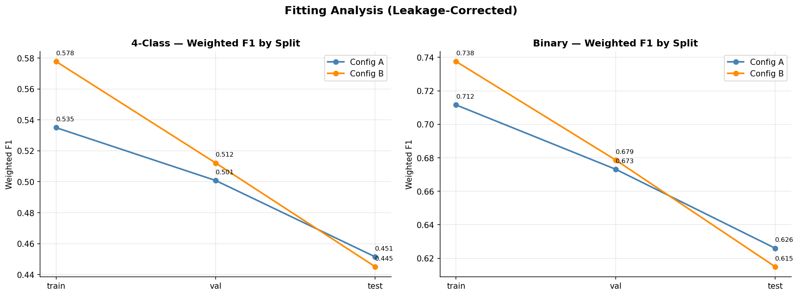

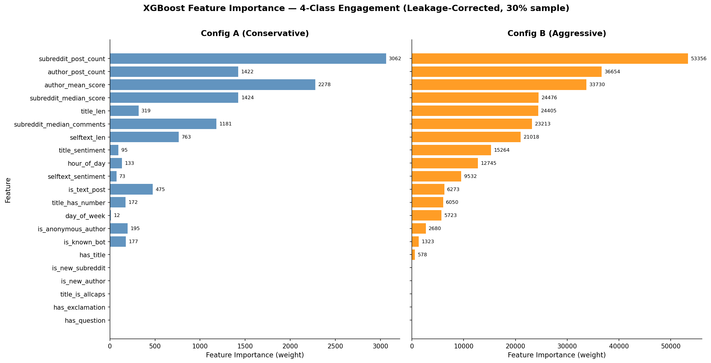

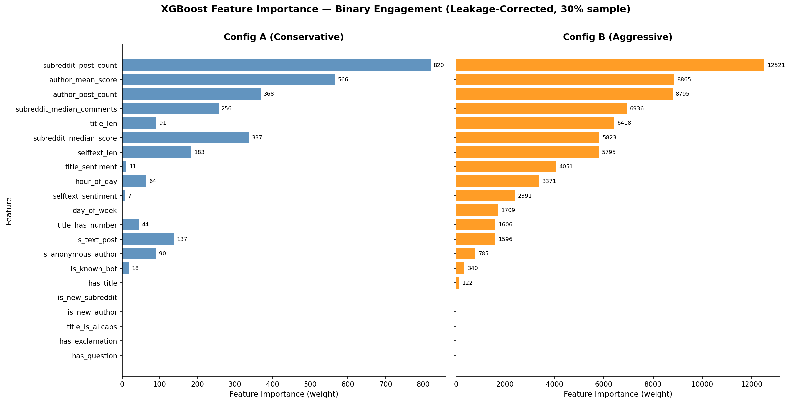


### Model 2 Results: SVD + Logistic Regression (Final Chosen Model)

**Explained Frobenius energy:**

| k | Cumulative Explained Energy |
|---|---|
| 1 | 0.29% |
| 10 | 1.40% |
| 50 | 4.80% |
| 100 | 7.90% |

The spectrum is nearly flat after the first component (σ₁ = 1,244; components 2–100 range ~878 to ~548) with no elbow, indicating high effective rank. k=100 was chosen as a pragmatic compute/performance tradeoff.


**Logistic Regression Weighted F1:**

| Model | regParam | Train WF1 | Val WF1 | Test WF1 |
|---|---|---|---|---|
| lr_4class_A | 0.10 | 0.4324 | 0.4783 | 0.4707 |
| lr_4class_B | 0.01 | 0.4424 | 0.4913 | 0.4793 |
| lr_binary_A | 0.10 | 0.6370 | 0.6744 | 0.6683 |
| lr_binary_B | 0.01 | 0.6464 | 0.6815 | 0.6723 |

The lighter-regularization Config B models edge Config A on every split. Both 4-class (0.4793) and binary (0.6723) test WF1 exceed the structured-only Model 1 test results (0.4514 and 0.6260).


**Confusion matrices (Config B, test):**


Per-class breakdown for lr_4class_B on the test split: low-engagement and viral are the best-classified classes. Crowd-pleaser and debate-starter show the lowest F1 scores (~0.19 and ~0.23 respectively), frequently misclassified into low-engagement and viral.


## Discussion

### The temporal target leak and what it revealed

The most consequential event in this project was discovering, during Milestone 4, that the Milestone 3 results were inflated by a temporal target leak. The per-author and per-subreddit aggregate features were computed over the full 2012–2018 dataset before the temporal train/validation/test split, so held-out rows were described by statistics that incorporated their own and future periods. Because the engagement label is itself a quantile function of `score` and `num_comments` (the very quantities those aggregates summarize) the features partially encoded the target for validation and test rows.

Correcting the leak (recomputing all aggregates on the training period only, with lineage breaks to prevent Spark from silently recomputing over the full data) lowered test weighted F1 by 0.10–0.14 across all four configurations and, notably, *reversed the configuration ranking*: under the leak the aggressive Config B won everywhere; post-fix the conservative Config A generalizes better, because once the leaked signal is gone Config B's extra depth overfits rather than helps. This is a cautionary lesson we would carry into any production setting as leakage does not merely inflate a number, it can invert the conclusions you draw about which model is best.

The correction also surfaced the project's central structural limitation: **48.6% of the 2018 test set are cold-start authors with no training-period history.** For these rows every author-aggregate feature is null, so the three features that dominate importance (`subreddit_post_count`, `author_mean_score`, `author_post_count`) carry no signal for nearly half of test. The corrected ceiling is therefore an *information* ceiling, not a model-capacity one. This was the direct motivation for the content-feature work in Milestone 4. If we cannot describe who posted something for half of test, the recourse is to describe what was posted.

### Did dimensionality reduction actually help? A controlled answer

The SVD retains only 7.9% of the title matrix's total Frobenius energy at k=100, which initially appears discouraging. The downstream results show, however, that retained energy and retained predictive signal are distinct quantities. The discarded 92% is largely per-post lexical noise (rare tokens, hash collisions) that does not generalize.

To isolate whether the SVD content features genuinely add signal we ran a controlled comparison experiment: retraining XGBoost on the same 117-dimensional feature set, with native NaN handling matching the Model 1 baseline, so the *only* variable changing is the feature set.

| Task | XGBoost structured-only (M1) | XGBoost + SVD (117-dim) | Effect of content features |
|---|---|---|---|
| 4-class test WF1 | 0.4514 | 0.4493 | Flat (within sample-size noise) |
| Binary test WF1 | 0.6260 | 0.6371 | +0.011 (clear gain) |

The honest conclusion is **task-dependent**: title content features measurably help the binary high/low distinction but are roughly neutral for the four-tier task on a fixed model. This refines the simpler "SVD adds signal" claim as the lift exists, but it is concentrated where the decision boundary is coarser. Distinguishing crowd-pleasers from debate-starters appears to require signal that 100 hashed-title components do not capture.

### Why logistic regression was chosen over XGBoost on the reduced features

Both models were trained on the identical 117-dimensional set. Logistic regression won on test for both tasks (4-class 0.4793 vs 0.4493; binary 0.6723 vs 0.6371), despite XGBoost achieving higher *training* F1. The gradient-boosted model overfits the dense, low-energy SVD features (100 components carrying 7.9% of the matrix energy give a tree ample room to fit sample-specific structure that does not generalize) while the regularized linear model generalizes more cleanly. This is the inverse-regularization story seen across the project: the two model families respond oppositely to added capacity, and on this feature geometry the simpler model is the better one. Logistic regression is therefore our final chosen model.

### Per-class behavior and the precision/recall tradeoff

The 4-class confusion structure is the clearest window into model behavior. Low-engagement and viral are learned well; the middle tiers are not as crowd-pleaser (F1 ~0.19) and debate-starter (F1 ~0.23) are frequently absorbed into the two majority classes. This is the expected signature of a linear model on classes that are not linearly separable: the middle archetypes ("high on one engagement axis but not the other") sit between the majorities and a single hyperplane per class cannot carve them out.

Interestingly, the XGBoost comparison recovered crowd-pleasers somewhat better than the linear model (recall 0.208 vs 0.155). This hints that the middle tiers want a non-linear boundary even though XGBoost loses overall. On the binary task, both models lean toward predicting high-engagement, with XGBoost trading precision for recall more aggressively (high-engagement recall 0.752 at precision 0.676, versus the linear model's more balanced 0.708/0.726). The linear model's more even operating point is part of why it wins on weighted F1.

### Fitting regime

For the logistic model, test and validation weighted F1 exceed training F1 across all four configurations. This is not anomalous generalization but an artifact of evaluation composition: training F1 is measured on class-weighted fits over a balanced 30% sample, where upweighted minority classes depress the weighted average, while validation and test carry the natural distribution dominated by the well-learned majority classes. Combined with the very low minority-class F1, this indicates **high bias** on the four-tier task. The linear model lacks the capacity to separate the middle tiers, and lighter regularization (Config B) improving every split confirms it wants more flexibility, not less. The corrected XGBoost model, by contrast, shows the normal pattern (train highest, falling to test), with the steeper drop for the higher-capacity Config B. This is a generalization gap, not underfitting.

### Component interpretability

Because TF-IDF was computed with `HashingTF` (a one-way hash with no inverse), there is no recoverable mapping from SVD component loadings back to vocabulary terms, so individual component interpretation is not possible with the current artifacts. Moreover, the nearly flat singular spectrum means the eigengaps between adjacent components are tiny, so individual tail axes are weakly determined and would rotate between fits. The reduced features are best treated as a subspace rather than interpreted axis by axis. A future iteration using `CountVectorizer` would restore an invertible vocabulary (enabling per-component term interpretation) at the cost of holding the full vocabulary in memory.


## Conclusion

This project set out to predict Reddit engagement *archetypes* — not merely whether a post would be popular, but what kind of engagement it would draw — from pre-publication features across 535 million posts. The headline result is that the binary high/low engagement distinction is meaningfully predictable (test weighted F1 0.672 with the final SVD + logistic regression model), while the four-tier distinction remains substantially harder (0.479), bounded by both a cold-start information ceiling and the linear separability of the middle archetypes.

Three findings stand out. First, the temporal leak correction was the project's defining moment: it lowered our headline numbers by 0.10–0.14 weighted F1, reversed which configuration we would have called best, and exposed that nearly half the test set consists of authors we have no history for. An impressive-looking result that does not survive scrutiny is worse than a modest one that does. Second, dimensionality reduction's value was task-dependent and only provable through a controlled same-model ablation — retained energy (7.9%) and retained predictive signal are genuinely different things. Third, on dense low-energy features the regularized linear model outgeneralized gradient-boosted trees, a reminder that model complexity should match feature geometry rather than default to the most powerful learner.

On big data specifically: this analysis was infeasible on a single machine. Per-author and per-subreddit aggregations over 535M rows, per-subreddit quantile label generation, a VADER sentiment UDF across the full dataset, and distributed SVD on a 10,000-dimensional sparse matrix all required Spark's distributed execution; the preprocessing pipeline alone achieved an ~11x speedup over a single-threaded baseline. Equally instructive were the limits we hit: `local[*]` mode on a single node repeatedly exhausted memory on the expanded 117-dimensional feature space, forcing sample-size reductions and ultimately blocking a full-scale XGBoost ablation. This is itself a finding as dimensionality expansion has a real memory cost, and the natural next step is true multi-node distribution.

With more time and resources we would: replace `HashingTF` with `CountVectorizer` for an interpretable vocabulary; increase the SVD rank (k = 500–1000) on a multi-node cluster; engineer point-in-time author features that accumulate history *within* the test period (leakage-free) to attack the cold-start ceiling directly; and explore a non-linear model on the reduced features to recover the middle engagement tiers that the linear model collapses.

## Contributions

| Member | Contributions |
|---|---|
| Eugene Kim | Main code and pipeline architect. Organized and constructed full repository. Engineered preprocessing, XGBoost, TF-IDF + SVD, Log Reg notebooks. Directed analysis and project narrative |
| Jack Keeton | Led development for data ingestion and initial exploration (Milestone 2). Aided efforts in feature engineering and tested the application of word embeddings. Developed GBT Classifier alternative for final model.|
| Aidan Sanchez | Document and task coordination. Assited in preprocessing, tree-based model fitting and experimentation. Assisted in analytical prose construction and interpretation. |

## References

- Baumgartner, J., Zannettou, S., Keegan, B., Squire, M., & Blackburn, J. (2020). The Pushshift Reddit Dataset. *Proceedings of the International AAAI Conference on Web and Social Media*, 14, 830–839.
- Apache Spark MLlib Documentation: https://spark.apache.org/docs/latest/ml-guide.html
- HuggingFace Datasets: https://huggingface.co/datasets/fddemarco/pushshift-reddit


# Appendix

## Milestone 2 & 3 Narrative Reports
This section contains the old README reports that were written during the course of the project. They are preserved below to so that the narrative of the project is kept intact. Many ideas, metrics, plans, etc. have been changed and are no longer incorporated in the final pipeline. 

### SDSC Expanse Setup and SparkSession Configuration (Milestone 2)

#### Milestone 2 SparkSession Configuration 

The Expanse JupyterLab portal launches Spark inside a Singularity container which defaults to `local[*]` mode. This means there is no separate cluster manager and no worker processes and all driver coordination and task execution run in a single JVM, using the node's 16 cores as parallel thread slots. Parallelism is still achieved, but it is thread-based within one JVM rather than distributed across separate executor processes. As a result, executor configuration parameters are set but not active, and the Spark UI shows a single executor row. We also allocate 8GB to driver memory account for this.

```python
from pyspark.sql import SparkSession

# 16 cores, 128GB total memory (local mode)
spark = SparkSession.builder \
    .appName("PushshiftRedditEDA") \
    .config("spark.driver.memory", "8g") \
    .config("spark.driver.maxResultSize", "4g") \
    .config("spark.executor.memory", "16g") \
    .config("spark.executor.instances", "6") \
    .config("spark.sql.shuffle.partitions", "200") \
    .config("spark.sql.parquet.enableVectorizedReader", "true") \
    .getOrCreate()
```

#### SparkUI Screenshot (Milestone 2)


## Notebook (Milestone 2)

The Milestone 2 EDA and data exploration notebook is located at: [`notebooks/Milestone2_Pushshift.ipynb`](notebooks/Milestone2_Pushshift.ipynb)

## Milestone 2 - Exploratory Data Analysis

### How many observations does your dataset have? 
The dataset contains 549,662,955 posts. 

### Describe all columns in your dataset: their scales and data distributions. Describe categorical and continuous variables. Describe your target column.
Dataset descriptions were provided above in the `Dataset` section but are described in further detail below to better address Milestone 2 requirements.

#### Categorical Columns

- **`id`** (string): Unique post identifier. Approximately 550M distinct values with only 1 duplicate found across the full dataset, confirming near-perfect uniqueness. Not used as a model feature.
- **`author`** (string): Reddit username of the poster. ~35.4M distinct users. Heavily skewed the top authors are bots and aggregator accounts (`AutoNewsAdmin`, `AutoNewspaperAdmin`, `politicbot`, etc.) responsible for millions of posts each. ~13.3% of posts have `[deleted]` authors and ~5.5% have empty string authors. Not directly encoded as a feature; represented through author history aggregations.
- **`subreddit`** (string): Community the post was submitted to. ~2.3M distinct subreddits. Extremely long-tailed r/AskReddit alone accounts for ~13.5M posts while the vast majority of subreddits have very few. Not directly encoded; represented through per-subreddit aggregation features.
- **`subreddit_id`** (string): Internal Reddit identifier for the subreddit. ~2.2M distinct values, closely tracking `subreddit` cardinality. Used for deduplication and join purposes only.
- **`selftext`** (string): Post body text. 72.8% of posts have empty selftext, indicating link or image posts with no body. The remaining 27.2% are text posts. No null or sentinel string values present in this version of the dataset absence is encoded as an empty string. Represented as a binary `is_text_post` flag and selftext character length in modeling.
- **`title`** (string): Post title text. Present for all 549M rows. Mean length ~50 characters, std dev ~37, max 1,592 characters. Used as the primary source of NLP features (word count, sentiment, readability, question/exclamation presence).

#### Continuous Columns

- **`score`** (long): Net upvotes at time of archival. Range: 0 to 270,469. Mean: 44.84, std dev: 707.38 extremely right-skewed. The vast majority of posts score in the single digits while a small number go viral. Median is consistently far below mean in every year. One of the two **target label inputs**.
- **`num_comments`** (long): Comment count at time of archival. Range: -117 to 517,003. Mean: 8.36, std dev: 93.11 similarly right-skewed. Negative values are a known Pushshift artifact and will be treated as 0. The other **target label input**.
- **`created_utc`** (long): Unix timestamp of post creation. Spans January 1, 2012 to December 31, 2018. Used to extract temporal features (hour of day, day of week) and for train/test splitting. Post volume shows a clear weekday peak (Mon–Thu) and grows steadily year over year across the dataset's coverage window.

#### Target Column

The target label is not a raw column but is derived from the joint distribution of `score` and `num_comments`. Each post is assigned one of four engagement archetypes using per-subreddit 50th percentile thresholds on both columns:

| Label | Score | Comments |
|---|---|---|
| `viral` | ≥ median | ≥ median |
| `crowd-pleaser` | ≥ median | < median |
| `debate-starter` | < median | ≥ median |
| `low-engagement` | < median | < median |

Per-subreddit thresholds are used rather than global thresholds because engagement norms vary drastically across communities — 100 comments is unremarkable in r/AskReddit but exceptional in a small niche subreddit. We expect significant class imbalance toward `low-engagement`, which will be addressed via inverse-frequency class weights during training.

### Do you have missing and duplicate values in your dataset?

#### Null Values

Null counts are low across almost all columns:

| Column | Null Count | % Missing |
|---|---|---|
| `subreddit` / `subreddit_id` | 306,479 | 0.056% |
| `score` | 21 | ~0% |
| All others | 0 | 0% |

#### Sentinel Strings

A critical data quality issue is Pushshift's use of sentinel strings instead of SQL NULLs and a naive null check will miss these entirely. Of the 549M `selftext` values, **399.5M are empty strings** (link posts with no body) and **150.1M contain actual text**. There are no NULL, `[removed]`, or `[deleted]` values in `selftext` in this version of the dataset and all placeholder content was stored as empty strings.

For `author`, deleted and anonymous accounts are encoded as `[deleted]` and empty strings rather than NULLs:

| Author Type | Count | % of Total |
|---|---|---|
| Real users | 444,817,691 | 80.9% |
| `[deleted]` | 73,272,560 | 13.3% |
| Empty string | 30,256,874 | 5.5% |
| `AutoModerator` | 1,315,830 | 0.2% |

#### Negative `num_comments` Values

`num_comments` has a minimum value of -117, which is a known Pushshift artifact where comment counts were recorded before Reddit's counters fully settled. These are invalid records rather than true missing values.

#### Duplicate Posts

Only **1 duplicate post ID** was found across 549,662,955 rows.

### Key Visualizations

#### Post Score Distribution


The score distribution is heavily right-skewed across all 549M posts. The vast majority of posts score in the 1–9 range, with each successive order of magnitude containing dramatically fewer posts. This confirms that raw score alone is a poor engagement signal. Collapsing this distribution into a binary high/low label would classify nearly everything as low-engagement. A per-subreddit quantile-based archetype label is a more meaningful and discriminative target.

#### Score vs. Comment Count (Log-Log Scale, n=50k Sample)


A 50,000-post sample plotted on a log-log scale shows a positive but noisy relationship between score and comment count. While the OLS trend line confirms a weak positive correlation, the substantial variance around it demonstrates that the two metrics capture meaningfully different engagement phenomena. Posts in the upper-left region (high comments, low score) represent debate-starters i.e., controversial content that drives discussion without broad approval. Posts in the lower-right (high score, low comments) represent crowd-pleasers, broadly liked but not discussion-generating. This scatter is the core visual justification for a four-archetype label over a single engagement metric.

## Preprocessing Plan

Preprocessing will be implemented in Milestone 3 using PySpark DataFrame operations. A key consideration is Pushshift's use of empty strings instead of SQL NULLs for missing `selftext`. A naive null check will miss these entirely. Bot and deleted author accounts are also prevalent and must be handled explicitly.

### Missing Values
- `title`: Rows with zero-length titles will be dropped as they contain no usable signal.
- `selftext`: Empty strings indicate link posts and are valid they will be flagged via a binary `is_text_post` indicator column rather than treated as missing.
- `author`: Rows with `[deleted]` or empty string authors will be filtered out as they cannot contribute to author history features. Authors posting at an inhuman frequency (above a defined daily post threshold) will be flagged as suspected bots and considered for removal.
- `subreddit` / `subreddit_id`: The ~306K null rows discovered in EDA will be dropped as they cannot contribute to per-subreddit features.
- `score` / `num_comments`: The 21 null score rows will be dropped. Negative `num_comments` values (-117 minimum) are a known Pushshift artifact and will be clipped to 0.

### Duplicate Posts
Only 1 duplicate post ID was found in EDA. All duplicate IDs will be deduplicated as a precaution.

### Class Imbalance
We expect the majority of posts to fall into the low-engagement class. This will be addressed using PySpark MLlib's `weightCol` parameter to assign inverse-frequency class weights during training, giving minority classes (viral, crowd-pleaser, debate-starter) proportionally higher influence on the loss function.

### Label Generation
Labels will be assigned using `pyspark.sql.Window` functions to compute per-subreddit 50th percentile thresholds for `score` and `num_comments`, then applying a four-way conditional to assign each post its engagement archetype. A two-tier high vs. low engagement label will also be generated for comparison against the four-class model.

### Feature Engineering
All features will be derived from pre-publication information only to prevent data leakage. Transformations include:

- **Title features**: character count, word count, question/exclamation presence, sentiment polarity, readability extracted using PySpark UDFs wrapping NLTK/TextBlob
- **Post type**: binary `is_text_post` flag derived from `selftext`; selftext character length for text posts
- **Author history**: mean score, posting frequency, subreddit diversity computed via `groupBy().agg()` aggregations across the full dataset
- **Subreddit context**: post volume, median score, median comment count computed via `groupBy().agg()` per subreddit
- **Temporal**: hour of day and day of week extracted from `created_utc` via `pyspark.sql.functions.from_unixtime`

### Scaling and Encoding
- All continuous features will be standardized using MLlib's `StandardScaler`
- Categorical features (`subreddit`, `author`) will not be directly one-hot encoded due to high cardinality (millions of unique authors, hundreds of thousands of subreddits). Each is represented through aggregated numerical features author history features for `author` and community context features for `subreddit`
- The final feature vector will be assembled using MLlib's `VectorAssembler`

### Key PySpark Operations
- `df.cache()` — prevent repeated full dataset scans across multiple actions
- `df.filter()` — remove null and invalid rows
- `df.fillna()` — impute missing values where applicable
- `Window.partitionBy()` + `percentile_approx()` — per-subreddit quantile thresholds for label generation
- `df.groupBy().agg()` — author and subreddit feature aggregations
- `df.withColumn()` + UDFs — title linguistic feature extraction
- `VectorAssembler` — final feature vector construction
- `StandardScaler` — feature normalization

## Milestone 3 — Preprocessing and XGBoost Model Fitting (4-Class and Binary)
> [!IMPORTANT]
> The numbers below are now stale due to a direct leak that was fixed during Milestone 4. The numbers are kept here to keep the honest narrative as many insights were derived from the leak. Please note the listed v2 notebook below contains the leakage-free code and numbers numbers. The pre-leakage notebook can be found in the reddit-engagement-classifier/notebooks/Milestone3_Notes folder.
> Details on the leak and the new performance numbers are given at the bottom of this Milestone 3 section. 

### Notebook (Milestone 3)

The Milestone 3 preprocessing and model fitting notebook is located at: [`notebooks/Milestone3_Pushshift_v2.ipynb`](notebooks/Milestone3_Pushshift_v2.ipynb)

### SparkSession Configuration (Milestone 3)

Driver memory was increased to 120GB to accommodate the full dataset pipeline. All execution runs in `local[*]` mode with 16 cores as parallel thread slots within a single JVM. Spark local spill directory was redirected to Lustre to account for the expensive computations that come with processing 535M rows using heavy aggregations.

```python
spark = SparkSession.builder \
    .appName("PushshiftRedditPreprocessing") \
    .config("spark.driver.memory", "120g") \
    .config("spark.driver.maxResultSize", "8g") \
    .config("spark.sql.shuffle.partitions", "200") \
    .config("spark.sql.parquet.enableVectorizedReader", "true") \
    .config("spark.local.dir", "/expanse/lustre/projects/uci157/ekim18/spark-tmp") \
    .getOrCreate()
```

### SparkUI Screenshot (Milestone 3)

Training used 16 Spark workers with `SparkXGBClassifier`, confirmed via the Spark REST API executor summary:


### Preprocessing Pipeline (Milestone 3)

All preprocessing was implemented using Spark DataFrame operations and Spark MLlib transformers on the full 535,480,818 row filtered dataset on SDSC Expanse.

**Filtering and Cleaning:**

| Filter | Rows Removed | Reason |
|---|---|---|
| Null `subreddit` / `subreddit_id` | ~306,479 | Cannot contribute to per-subreddit features |
| Null `score` | 21 | Required for label generation |
| Negative `num_comments` | 1,090 | Pushshift artifact, value unverifiable |
| Duplicate `id` | 0 | Only 1 duplicate row existed and removal was not worth the compute |

**Label Generation:**
Per-subreddit 75th percentile thresholds on `score` and `num_comments` were computed using `Window.partitionBy()` and `percentile_approx()` to assign four engagement archetypes. A binary high/low label was also generated for comparison. StringIndexer was applied to both label columns.

| Label | Class | Distribution |
|---|---|---|
| Low-engagement | 0 | 44.3% |
| Viral | 1 | 29.9% |
| Crowd-pleaser | 2 | 14.0% |
| Debate-starter | 3 | 11.8% |

**Binary Label Distribution:**

| Label | Class | Distribution |
|---|---|---|
| Low-engagement | 0 | 44.3% |
| High-engagement | 1 | 55.7% |

**Features (19 total, all pre-publication):**
- Title structural: `title_len`, `has_question`, `has_exclamation`, `title_has_number`, `title_is_allcaps`
- Post type: `has_title`, `is_text_post`, `selftext_len`
- Author flags: `is_known_bot`, `is_anonymous_author`
- Temporal: `hour_of_day`, `day_of_week`
- Author history aggregations: `author_post_count`, `author_mean_score`
- Subreddit context aggregations: `subreddit_post_count`, `subreddit_median_score`, `subreddit_median_comments`
- NLP sentiment (VADER UDF): `title_sentiment`, `selftext_sentiment`

**MLlib Pipeline:** Imputer (mean, `selftext_sentiment` only) → StringIndexer → VectorAssembler → StandardScaler (fit on train only)

**Train/Val/Test Split (temporal):**

| Split | Years | Rows |
|---|---|---|
| Train | 2012–2016 | 276,442,594 |
| Val | 2017 | 114,089,205 |
| Test | 2018 | 144,949,019 |

### Model Training (Milestone 3)

We trained two XGBoost configurations (`SparkXGBClassifier`, XGBoost 2.0.3) on both the 4-class and binary label tasks so four models total. All models were trained on the full 276M row training split with 16 workers and 16 partitions (~17M rows per worker).

**Config A — Conservative (shallow, regularized):**

| Parameter | Value |
|---|---|
| `max_depth` | 4 |
| `n_estimators` | 200 |
| `learning_rate` | 0.05 |
| `subsample` | 0.8 |
| `colsample_bytree` | 0.8 |
| `reg_lambda` | 5.0 |
| `reg_alpha` | 1.0 |
| `min_child_weight` | 50 |

**Config B — Aggressive (deep, fast learning):**

| Parameter | Value |
|---|---|
| `max_depth` | 8 |
| `n_estimators` | 300 |
| `learning_rate` | 0.1 |
| `subsample` | 0.7 |
| `colsample_bytree` | 0.7 |
| `reg_lambda` | 1.0 |
| `reg_alpha` | 0.0 |
| `min_child_weight` | 10 |

**Training Times:**

| Model | Config A | Config B |
|---|---|---|
| 4-Class | 3,610.9s (~1hr) | 7,059.0s (~2hrs) |
| Binary | ~3,600s (~1hr) | ~7,200s (~2hrs) |

### Model Evaluation Results (Milestone 3)

**4-Class Weighted F1:**

| Config | Train | Val | Test |
|---|---|---|---|
| Config A | 0.5283 | 0.5759 | 0.5689 |
| Config B | 0.5767 | 0.6089 | 0.5866 |

**Binary Weighted F1:**

| Config | Train | Val | Test |
|---|---|---|---|
| Config A | 0.7087 | 0.7435 | 0.7280 |
| Config B | 0.7375 | 0.7642 | 0.7440 |

**4-Class vs Binary Comparison (Test Weighted F1):**

| Config | 4-Class WF1 | Binary WF1 | Delta |
|---|---|---|---|
| Config A | 0.5689 | 0.7280 | +0.1590 |
| Config B | 0.5866 | 0.7440 | +0.1574 |

### Model Fitting Analysis (Milestone 3)

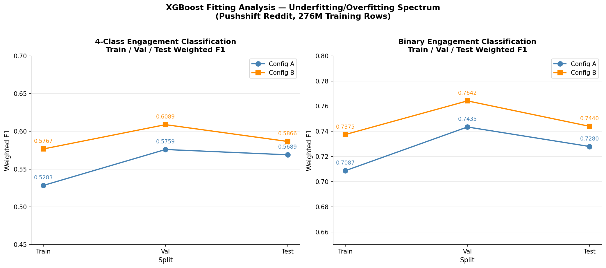

Both models sit firmly in the underfitting region of the bias-variance spectrum. Train F1 is consistently lower than val and test F1 across all configurations and both label tasks which is the opposite of the overfitting pattern. This is probably driven by a temporal shift: the 2012–2016 training set covers Reddit's noisy early growth phase, while the 2017 val and 2018 test sets represent a more behaviorally stable platform where posting patterns are more consistent and predictable.

Config B outperforms Config A across every split and both tasks. The deeper trees and faster learning rate allow Config B to capture more complex feature interactions, particularly the relationship between subreddit-level aggregates and engagement thresholds.

### Feature Importance (Milestone 3)

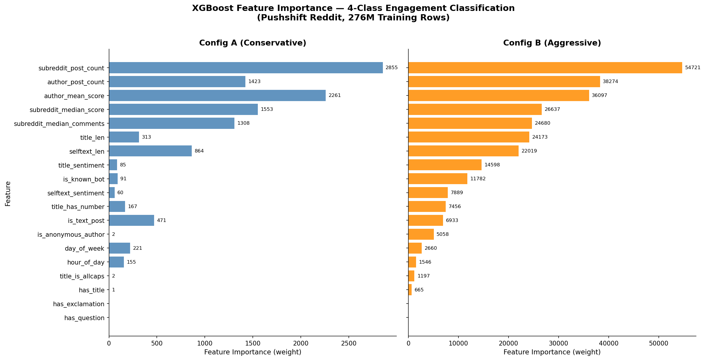

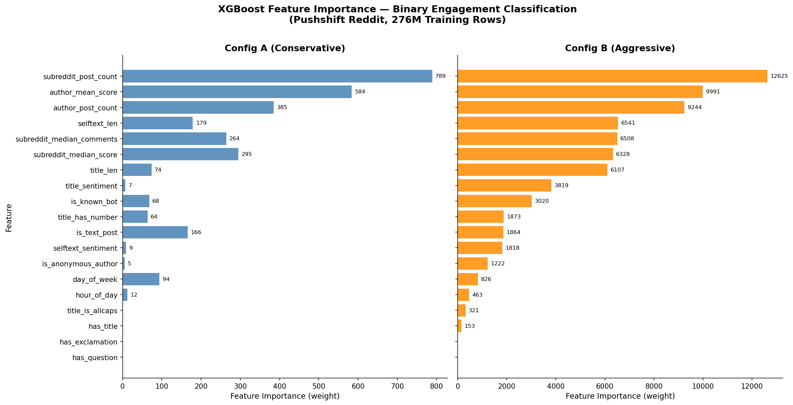

Community and author context features dominate both tasks with our current feature set. `subreddit_post_count`, `author_mean_score`, and `author_post_count` are the top three features in every configuration. This implies knowing which community a post belongs to and the historical track record of its author is far more predictive than any structural property of the post itself. `has_question` and `has_exclamation` contribute zero weight in Config A across both label tasks and are candidates for removal in Milestone 4.

### Speedup Analysis (Milestone 3)

The VADER selftext sentiment UDF applied to 535,480,818 rows was used as the representative distributed operation for speedup measurement.

| Executors | Time (sec) | Speedup | Efficiency |
|---|---|---|---|
| 1 | 25,914 (estimated) | 1.00x | 100% |
| 16 | 2,308 | 11.23x | 70.2% |

**Speedup** = T₁ / T₁₆ = 25,914 / 2,308 = **11.23x**

**Efficiency** = 11.23 / 16 = **70.2%**

Using Amdahl's Law, the implied parallel fraction is approximately 96.4%, with the remaining ~3.6% serial fraction corresponding to task scheduling overhead, Python UDF initialization, and VADER analyzer instantiation per partition. The single-thread baseline is estimated from a 10,000-row benchmark sample extrapolated to the full dataset. Running the full pipeline single-threaded would require approximately 7 hours of wall time beyond the project's time constraints. 

### Conclusion (Milestone 3)

The 4-class XGBoost models demonstrate that Reddit engagement archetypes are meaningfully predictable from pre-publication features, achieving a test weighted F1 of 0.5866 (Config B) on a 4-class problem across 102,739 subreddits using only 19 features. Both models underfit due to a hard ceiling imposed by the pre-publication feature set. Without access to post content, the model cannot distinguish crowd-pleaser from debate-starter posts reliably, as reflected in the low per-class F1 scores for these minority classes (0.33–0.38 on test). The binary task confirms that the high/low engagement distinction is substantially more learnable from these features, achieving 0.7440 test WF1, showing consistent ~0.16 point lift over the 4-class task across all configurations.

**Improvements for Milestone 4:** Incorporating Word2Vec title embeddings to add semantic content signal, removing zero-weight features (`has_question`, `has_exclamation`), and potentially exploring LightGBM as an alternative to XGBoost given its faster training on large datasets. A neural net model could be explored too. 

**How distributed computing helped:** The preprocessing pipeline involved per-author and per-subreddit aggregations, VADER sentiment UDF, and StandardScaler fit, all on 535M rows and exceeds single-machine memory capacity. Spark's distributed execution achieved an 11.23x speedup over single-thread baseline. Model training itself used 16 parallel XGBoost workers via `SparkXGBClassifier`, reducing training time to ~1–2 hours per model compared to an estimated 16+ hours single-threaded.


## Milestone 3 Corrected - Leakage Detection: Per-Author and Per-Subreddit Target Leak Details and Resolution (XGBoost Retrain)
 
 #### The Target Leak: Discovery and Resolution

While reviewing the Milestone 3 pipeline in preparation for Milestone 4, we identified a target leak in how the per-author and per-subreddit aggregate features had been engineered. The leak was not uniform and it entered through two distinct feature families and at differing magnitudes which is part of why it initially escaped notice.

**How the leak entered.** The aggregate features summarize the very quantities the label is built from. The per-subreddit features (`subreddit_post_count`, `subreddit_median_score`, `subreddit_median_comments`) and the per-author features (`author_post_count`, `author_mean_score`) were each computed with a `groupBy().agg()` over the **full 2012–2018 dataset**, before the temporal train/validation/test split was applied. Because the label is a per-subreddit quantile function of `score` and `num_comments`, any feature that aggregates those same columns over a window that includes the validation or test period is effectively a partial summary of the target for those rows.

**Why the magnitude varied.** The leak's severity differed by feature family. The per-subreddit median features leaked most directly — they are computed from the same percentile machinery that defines the label, so a subreddit-median feature spanning the test period encodes the test-period thresholds themselves. The per-author features leaked more diffusely: `author_mean_score` over the full window let a 2018 test row "see" an author's 2018 average score, but the connection to the row's own label is weaker than for the subreddit medians. The result was a leak of varying magnitude rather than a single clean offset. This is consistent with the inconsistent inflation observed once we measured it (next section).

**How we found it.** The leak surfaced during the Milestone 4 review when we traced the feature-construction lineage back through the notebook and noticed the aggregate `groupBy` operations preceded the temporal split rather than following it. The tell was that the validation and test weighted-F1 scores were *higher* than training.

**How we resolved it.** We rebuilt the feature pipeline so that all per-author and per-subreddit aggregates are computed on the **training period only** (2012–2016), then joined onto the validation and test rows as fixed, training-derived statistics. A held-out row is now described purely by what its author and subreddit looked like during the training window — never by its own or any future period. Lineage breaks were inserted between the aggregate computation and the downstream joins to prevent Spark's lazy evaluation from silently recomputing the aggregates over the full dataset. The XGBoost models were then fully retrained on the corrected features; no hyperparameters were changed, so the resulting performance differences isolate the effect of the leak correction alone.

#### Corrected Milestone 3 results (post-fix — used as the M4 baseline)

**4-Class Weighted F1 (corrected):**

| Config | Train | Val | Test |
|---|---|---|---|
| Config A | 0.5350 | 0.5008 | **0.4514** |
| Config B | 0.5778 | 0.5122 | 0.4451 |

**Binary Weighted F1 (corrected):**

| Config | Train | Val | Test |
|---|---|---|---|
| Config A | 0.7116 | 0.6732 | **0.6260** |
| Config B | 0.7375 | 0.6787 | 0.6149 |

> [!IMPORTANT]
> **Reversal #1 — configuration ranking flipped.** The stale analysis above concluded
> "Config B outperforms Config A across every split and both tasks." After the leak fix
> this is no longer true: on **test**, the conservative Config A now generalizes *better*
> than the aggressive Config B for both tasks (4-class 0.4514 vs 0.4451; binary 0.6260 vs
> 0.6149). Once the leaked signal is removed, Config B's extra depth overfits rather than
> helps. Config A is therefore carried forward as the Milestone 4 baseline.


The fitting curves make the corrected behavior explicit. For both tasks, weighted F1 falls monotonically from train to validation to test, and the two configurations **cross**: Config B starts higher on train (its extra depth fits the training sample better) yet ends lower on test, while the more regularized Config A degrades more gently and generalizes better. This crossover is the signature of Config B overfitting once the leak is gone.

> [!IMPORTANT]
> **Reversal #2 — fitting regime reinterpreted.** The stale analysis above described both
> models as sitting "firmly in the underfitting region," attributing the train-below-test
> pattern to a temporal shift between Reddit's early and later years. That interpretation
> was an artifact of the leak. In the corrected results, **train is the highest split and
> performance falls to test** — a normal generalization gap, steepest for the
> higher-capacity Config B. The corrected models are bounded not by underfitting but by the
> cold-start information ceiling described above: structured features cannot describe the
> ~48.6% of test authors with no training-period history.

**Per-class test F1 (Config A, the carried-forward baseline):**

| Class | 4-class F1 | Binary F1 |
|---|---|---|
| low-engagement | 0.466 | 0.5379 |
| viral | 0.5619 | — |
| crowd-pleaser | 0.2783 | — |
| debate-starter | 0.2567 | — |
| high-engagement | — | 0.688 |

The 4-class minority classes (crowd-pleaser 0.28, debate-starter 0.26) are the weakest even in the corrected baseline, confirming the structured features struggle most with the middle engagement tiers. This is the gap Milestone 4's content features attempt to close.

#### Feature importance (leakage-corrected)


Community and author context still dominate both tasks: `subreddit_post_count`, `author_mean_score`, and `author_post_count` remain the top features in every configuration. This is also why the cold-start population is so limiting. For an author with no training-period history, the three most important features carry no information.

> [!IMPORTANT]
> **Refinement — zero-weight features confirmed and acted on.** The stale analysis flagged
> `has_question` and `has_exclamation` as zero-weight "candidates for removal." The
> corrected feature-importance plots confirm this and extend it: `has_question`,
> `has_exclamation`, `title_is_allcaps`, `is_new_author`, and `is_new_subreddit` all carry
> effectively zero tree weight. In Milestone 4 the first four are dropped; `is_new_author`
> and `is_new_subreddit` are **retained** despite zero tree importance, because they serve a
> different role in the linear model — flagging which rows had aggregates imputed, signal a
> regularized linear model can use that a tree splitting on the imputed value cannot.